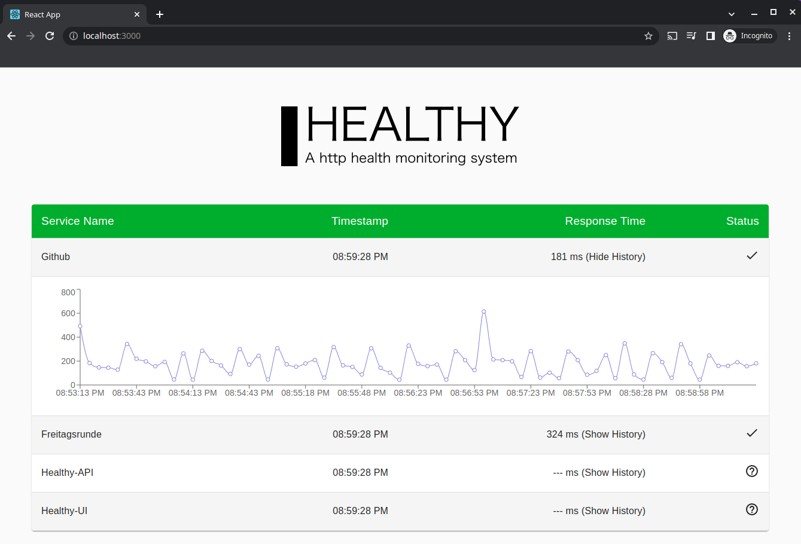

# Healthy - A http health monitoring system

**DISCLAIMER**: I used this little project to learn Kotlin and ReactJS. Probably there is a lot to improve and there are some bugs :) So please be careful if you want to use it and for sure feel free to contribute.




## Description

The project has two components. The *healthy-api* which is quering the webpage you want to monitor and the *healthy-ui* to display the result of the query.

[Healthy-API Readme](healthy-api/README.md)

[Healthy-UI Readme](healthy-ui/README.md)

### Why?

I haven't found a service that lets me easily specify endpoints which I want
to monitor. I just wanted to know if they are up and running.

## How to run it

You can build the project with the *docker-compose-dev.yaml* or create the *healthy-api* and/or *healthy-ui* separatly. To create them independently, please look into the **README.md** above.

The following command will build the docker containers from the source code and run them.
```
# docker-compose -f docker-compose-dev.yaml up --build
```

If you want to download the images from [dockerhub](https://hub.docker.com/u/hechi) you can use the *docker-compose.yaml* to do so.
```
# docker-compose up
```

## Configuration

The *healthy-api* can be configured via the **healthy.yaml** file. If none is provided it will use the [default](healthy-api/src/main/resources/healthy.yaml) one.

```
endpoints:
  - name: Github
    url: https://github.com
    upHttpCode:
      - 200
      - 201
    downHttpCode:
      - 300
      - 301
      - 302
```

| Entry        | Description |
| ------------ | ----------- |
| endpoints    | array of http services to query |
| name         | display name of the service |
| url          | HTTP or HTTPS url to query |
| upHttpCode   | array of HTTP response codes which indicates that the service is healthy |
| downHttpCode | array of HTTP response codes which indicates that the service is unhealthy | 